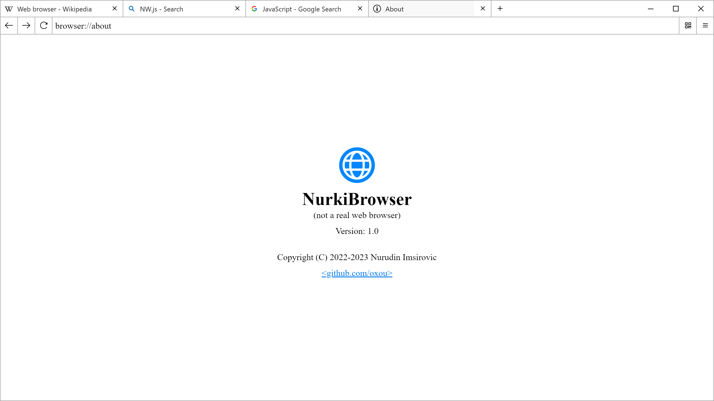
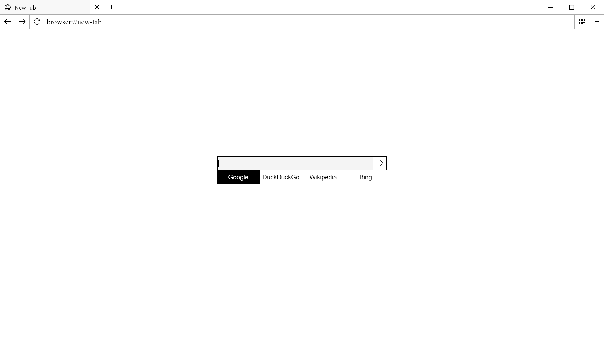
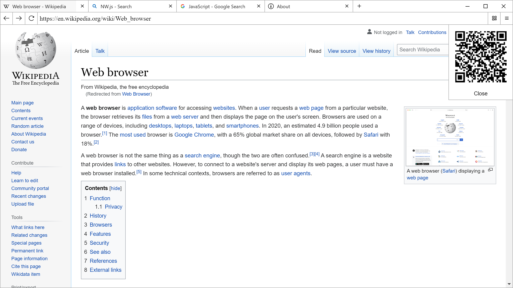

# Concept - NurkiBrowser

This repository hosts the source code for the concept of a web browser like application.

It is not a real web browser.

It uses [NW.js](https://nwjs.io/) as the core, alongside some of my ugly JavaScript code that mimics the functionality of a real web browser.

# Installation

1. Download [NW.js](https://nwjs.io/) (the normal version)
2. Extract `nwjs-vx.xx.x-win-x64.zip` zip (for example `C:\nurkibrowser`)
3. Download [`concept-nurki-browser-main.zip`](https://github.com/oxou/concept-nurki-browser/archive/refs/heads/main.zip) and extract it to `C:\nurkibrowser`
4. Run `nw.exe`
